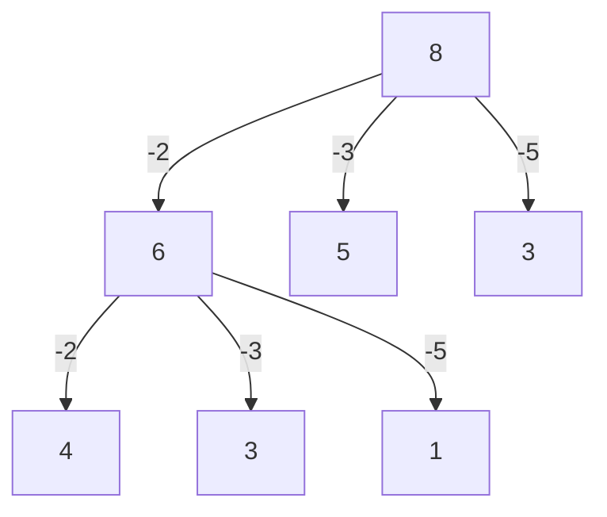

Write a function `bestSum(target, numbers)` that takes in a targetSum and an array of numbers as arguments

The function should rreturn an array containing the sorterst combination of numbers that add up to exactly the targetSum

If there a tie for the shortest combination, you may reuturn any one of the shortest.

_Examples_
`bestSum(8,[2,3,5]) ->[?]`

