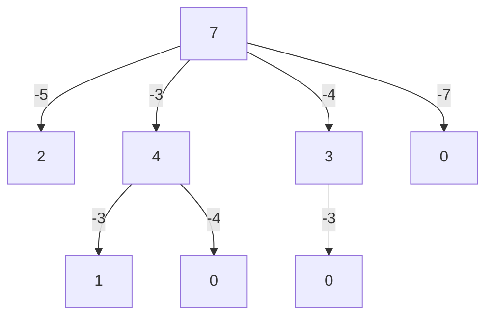
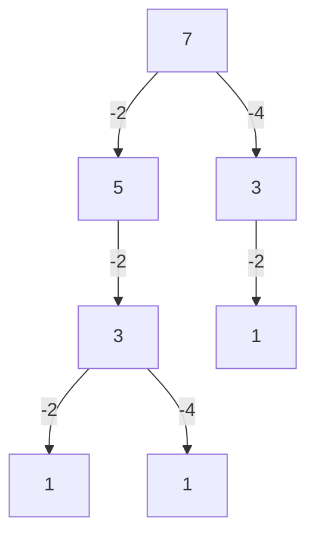
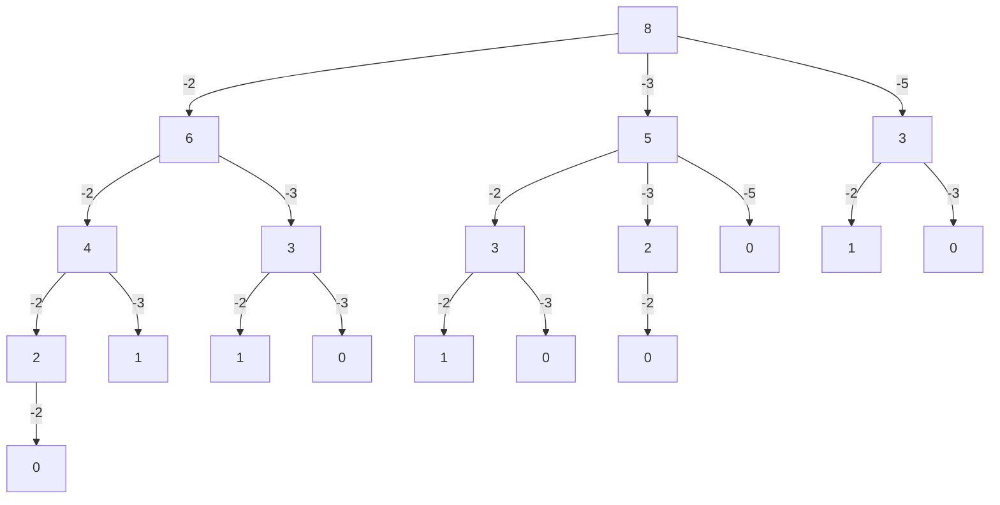

# Can Sum

Write a function `canSum(targetSum,numbers)` that takes in a targetSum and array of numbers as arguments.

```typescript
const canSum = (targetSum: number, numbers: number[]): boolean => {
  if (targetSum === 0) return true;
  if (targetSum < 0) return false;
  for (let num of numbers) {
    const remainder = targetSum - num;
    if (canSum(remainder, numbers) === true) return true;
  }
  return false;
};
```

`canSum(7,[5,3,4,7]) -> true`



`canSum(7,[2,4]) -> false`



## Memoize It

```typescript
const canSum = (
  targetSum: number,
  numbers: number[],
  memo: { [key: number]: boolean } = {}
): boolean => {
  if (targetSum in memo) return memo[targetSum];
  if (targetSum === 0) return true;
  if (targetSum < 0) return false;

  for (let num of numbers) {
    const remainder = targetSum - num;
    if (memoizedCanSum(remainder, numbers, memo) === true) {
      memo[targetSum] = true;
      return true;
    }
  }
  memo[targetSum] = false;
  return false;
};
```

`canSum(8,[2, 3 , 5]) -> true`


