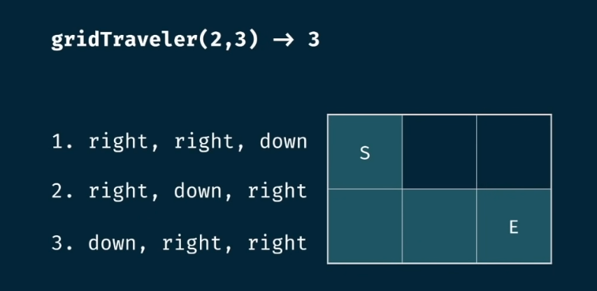
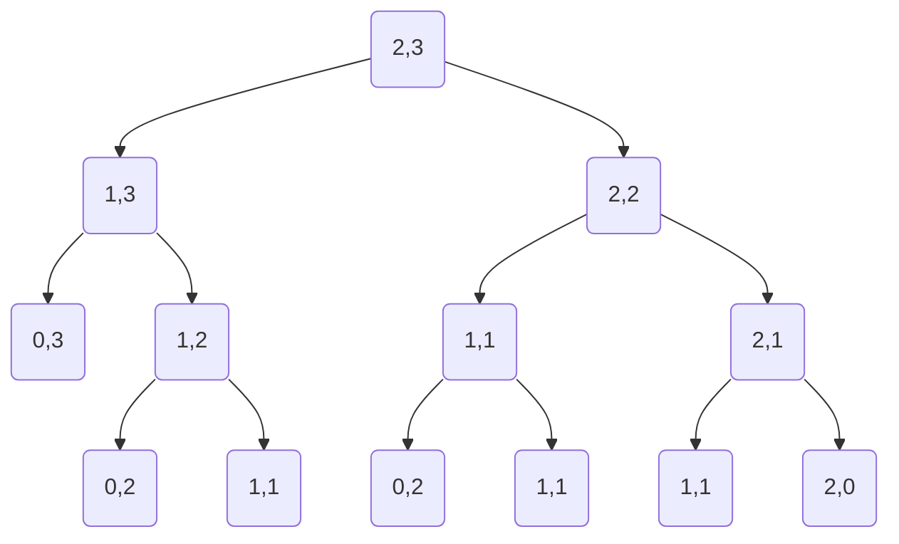

# GRID TRAVELER

Say that you are a traveler onb a 2D grid. You begin in the top-left corner and your goal is to travel to the bottom-right corner. You may only move down or right.

In many ways can you travel to the goal on a grid with dimensions m \* n?

Tips:
**1 - Make it work**

- visualize the problem as tree
- implement the tree using recursion

- test it

2 - Make it efficient

- Add a memo object
- Add a base case to return memo values
- store return values into the memo

`gridTraveler(2,3)`

