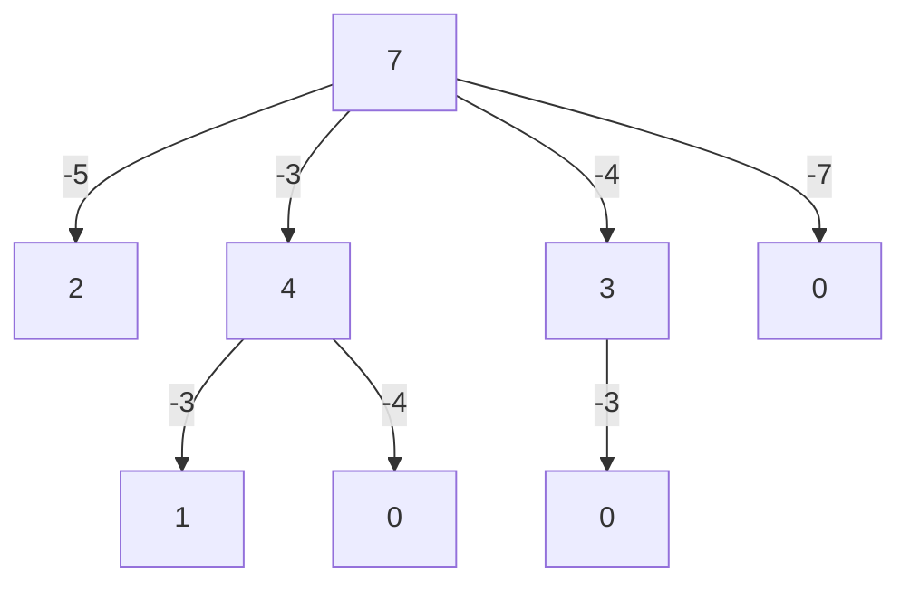

Write a function `howSum(targetSum, numbers)` that takes in a targetSum and an array of numbers as arguments

The function should return and array containing any combinations of elements that add up to exactly the targetSum. If there is no combination that adds up to the targetSum, then return null

`howSum(7,[5,3,4,7]) -> [4,3]`

